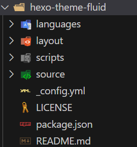

##  各个文件简介
1. node_modules：存放一些相关组件
2. sourses：博客以markdown形式存放在这里
3. themes：主题存放
4. config.yml:hexo配置比如标题作者在这里进行配置(最重要)
5. public:经过hexok g生成的静态网站存放在这里，会按照时间等对曾经喜欢的文章存放

## hexo主题的安装与推荐
1. 在hexo官网中找主题
2. 复制下载链接
3. 进入终端Blog文件夹
4. 粘贴下载
5. 在config.yml中修改相关信息
6. hexo s 启动

## 自定义博客结构
1. 找到存放主题的文件并打开（文件搜获）
   

## 书写文章以及文章的分类与标签
1. 看源文件


## 基本建立
```markdown
hexo s //启动博客
hexo n "文件名称"  //生成博客文章
```
点击进md文件进行博客编写

## 三板斧
```markdown
hexo clean  //清理
hexo g  //生成静态
hexo s  //再启动 
``

## 将博客部署到远端（github）
hexo d 推送到远端