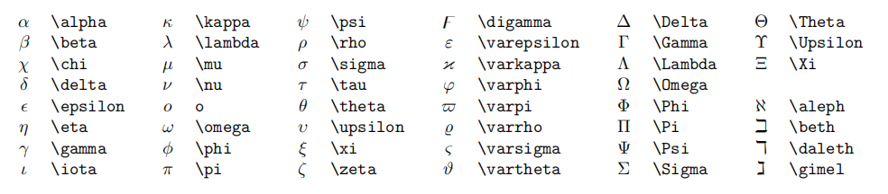

## 一、打开预览窗口
ctrl+k,v
## 二、简单markdown语法
1. 段落,加粗
2. 分割线
---
3. 引用
>你好
>nihao
4. 代码块
```python
print("helloworld")
```

```python{.line-numbers}
print("helloworld")
```
5.  超链接
   [链接名称](链接地址)
6. 图片
    cltr+alt+v:保存到Images中
    


## 三、数学公式(ctrl+m)(补全)

1. 上下标
   1. xtp: $x^{3}$
   2. xsb: $x_{3}$

2. 分式根式
   1. //配合tab：$\frac{12}{34}$
   2. hsq: $\sqrt[3]{2}$

3. 累加累乘
   1. sum: $\sum_{n+1}^n=\frac{1}{k}$
   2. prod: $\prod_{n=1}^{\infty} $

4. 积分
   1. dint: $\int_{-\infty}^{\infty}  \mathrm{d}x$

5. 括号
   1. $\left(  \frac{1}{k} \right)$
6. 对其
   1. 一个$+ali: 左对齐
   2. 两个$+ali: 右对齐

   $$
   \begin{aligned}
   y &=(x+5)^2-(x+1)^2 \\
   &=(x^2+10x+25)-(x^2+2x+1) \\
   &=8x+24 \\
   \end{aligned}
   $$

   $
   \begin{aligned}
   y &=(x+5)^2-(x+1)^2 \\
   &=(x^2+10x+25)-(x^2+2x+1) \\
   &=8x+24 \\
   \end{aligned}
   $

7. 方程组
   1. case
   $\begin{cases} 
   1+2&=8  \\
   3+6+4&=24 \\
   2+3&=5 
   \end{cases}$

8. 矩阵
   1. 矩阵：bmat2 bmat3
   $\begin{bmatrix} 1 & 2  & 3 \\ 3 & 4 & 5 \\7  & 8 & 5 \\\end{bmatrix}$
   2.行列式
   $\begin{bmatrix} 1&2&3 \\ 4&5&5 \\ 7&8&9 \\\end{bmatrix}$

## 快捷键

1. Ctrl + Z,：撤销
Ctrl + Shift + Z： 反撤销
Shift + ← ：向左选中一个字符
Shift + → ：向右选中一个字符
Ctrl + Shift + →： 向右选中一个单词
Ctrl + Shift + ←： 向左选中一个单词
Shift + Alt + ↑ 向上复制当前行或选中多行
Shift + Alt + ↓ 向下复制当前行或选中多行
Alt + ↑ 向上移动当前行或选中多行
Alt + ↓ 向下移动当前行或选中多行

## 计算器
Ctrl + Shift + Alt + E 计算当前选中表达式, 用等号连接并输出
Ctrl + Shift + Alt + R 计算当前选中表达式, 并替换当前选中表达式
Ctrl + Shift + Alt + D 定义当前选中表达式, 无输出

## Markdown高级用法
1. 目录
   [TOC]


## 背诵

1. 符号

1. 
**  ➡  $\cdot$
xx  ➡  $\times$
otimes  ➡  $\otimes$
<=  ➡  $\le$
!=  ➡  $\neq$
==  ➡  $\equiv$
~~  ➡  $\thickapprox$
sim  ➡  $\sim$
land  ➡  $\land$
lor  ➡ $\lor$
bec  ➡  $\because$
thr  ➡  $\therefore$
EE  ➡  $\exists$
AA  ➡  $\forall$
inn  ➡  $\in$
sse  ➡  $\subseteq$
cap  ➡  $\cap$
cup  ➡  $\cup$
empty  ➡  $\empty$
oo  ➡  $\infty$
lim  ➡  $\lim_{<n> \to <\infty>}$
dd  ➡  $\mathrm{d}$
part  ➡  $\frac{\partial <V>}{\partial <x>}$
Delta  ➡  $\Delta$
nabla  ➡  $\nabla$
...  ➡  $\cdots$
txt  =>  $\text{...}$
xbar  =>  $\bar{x}$
xhat  =>  $\hat{x}$
xhvec  =>  $\vec{x}$
xhdot  =>  $\dot{x}$
Xbf  =>  $\mathbf{X}$
Xcal  =>  $\mathcal{X}$
Xfrak  =>  $\mathfrak{X}$


