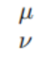
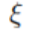
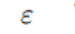
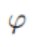

1. 上标： xtp: $x^{3}$
2. 下标： xsb: $x_{5}$ 可以配合tab连用：$x_{3}^{5}$
3. 分式： //: $\frac{4x}{30}$
4. 根式： hsq: $\sqrt{4}$   $\sqrt[x]{x}$
5. 累加： sum: $\sum_1^\infty n$
6. 累乘： prod: $\prod_{n=1}^{\infty} $
7. 积分： int: $\int_{-\infty}^{\infty} \frac{1}{x} \mathrm{d}x$
8. 二重积分：iint: $\iint_1^\infty x dx$
9. 括号： 打: $\left( \frac{1}{k}\right)$
10. 式子左对齐： \$+ali: $\begin{aligned}
x+1\\
y+1 \\
\end{aligned}$

1.  式子右对齐：\$\$+ali: $$
\begin{aligned}
x+1\\
y+1 \\
\end{aligned}
$$ 

1.  方程组+等号对齐：case:  $\begin{cases} x+y &=5  \\ x-y+z &=7  \end{cases}$
2.  矩阵(matrix矩阵）：bmat3: $\begin{bmatrix} 1 & 4 & 6 \\ 1 & 5 & 4 \\ 6 & 7 & 9 \\\end{bmatrix}$
3.  行列式： vamt3: $\begin{vmatrix} 3 & 5 & 7 \\ 8 & 9 & 7 \\ 6 & 5 & 9 \\\end{vmatrix}$
4.  计算： ctrl+alt+shift+e
     $\sin\frac{\pi}{4} = \frac{\sqrt{2}}{2}$
5.  点乘： **: $\cdot $
6.  叉乘： xx: $\times $
7.  异或： otimes: $\otimes $
8.  大于等于： >=: $\ge $
9.  小于等于： <=: $\le $
10. 不等于： !=: $\neq $
11. 恒等于： ==: $\equiv $
12. 约等于： ~~: $\approx $
13. 近似于： sim: $\sim $
14. 逻辑与： land(luoji_and):$\land $ 
15. 逻辑或： lor:$\lor $
16. 逻辑非： lnot: $\lnot $
17. 因为： bec: $\because $
18. 所以： thr: $\therefore $
19. 存在： EE: $\exists $
20. 任意： AA: $\forall $
21. 属于： inn: $\in $
22. 包含于： sse: $\subseteq $
23. 交集： 
24. 并集： 
25. 空集
26. 无穷： 
27. 极限： 
28. 微分： 
29. 偏导： 
30. 点求导： 
31. 向量： 
32. 复合： 
33. α： 
34. β： 
35. δ： 
36. ε： 
37. η： 
38. γ： 
39. λ： 
40. ω： 
41. φ： 
42. ψ： 
43. ρ： 
44. σ： 
45. τ： 
46. θ： 
47. υ： 
48. ζ： 
49. Δ： 
50. Ω： 
51. Φ： 
52. ： 
53. 派： 
54. ： 
55. ： 
56. ： 
57. 左箭头： 
58. 右箭头： 
59. 右推导： 
60. 左推导： 
61. 加减： 
62. 对数，计算： 
63. 封闭积分： 
64. 角30： 