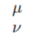

1. 上标： 
2. 下标： 
3. 分式： 
4. 根式： 
5. 累加： 
6. 累乘： 
7. 积分： 
8. 二重积分： 
9. 括号： 
10. 式子左对齐： 
11. 式子右对齐： 
12. 方程组+等号对齐： 
13. 矩阵： 
14. 行列式： 
15. 计算： 
     $\sin\frac{\pi}{4}$
16. 点乘： 
17. 叉乘： 
18. 异或： 
19. 大于等于： 
20. 小于等于： 
21. 不等于： 
22. 恒等于： 
23. 约等于： 
24. 近似于： 
25. 逻辑与： 
26. 逻辑或： 
27. 逻辑非： 
28. 因为： 
29. 所以： 
30. 存在： 
31. 任意： 
32. 属于： 
33. 包含于： 
34. 交集： 
35. 并集： 
36. 空集
37. 无穷： 
38. 极限： 
39. 微分： 
40. 偏导： 
41. 点求导： 
42. 向量： 
43. 复合： 
44. α： 
45. β： 
46. δ： 
47. ε： 
48. η： 
49. γ： 
50. λ： 
51. ω： 
52. φ： 
53. ψ： 
54. ρ： 
55. σ： 
56. τ： 
57. θ： 
58. υ： 
59. ζ： 
60. Δ： 
61. Ω： 
62. Φ： 
63. ： 
64. 派： 
65. ： 
66. ： 
67. ： 
68. 左箭头： 
69. 右箭头： 
70. 右推导： 
71. 左推导： 
72. 加减： 
73. 对数，计算： 
74. 封闭积分： 
75. 角30： 